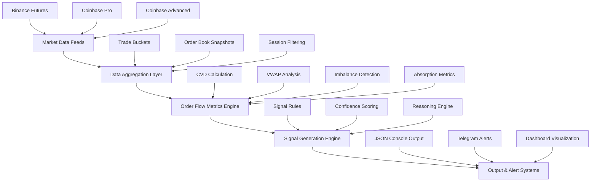

# FlowSight - Advanced Order Flow Analysis Engine

[](https://python.org)
[](LICENSE)
[](https://github.com/psf/black)
[](http://mypy-lang.org/)

 **Professional-grade real-time order flow analysis engine for quantitative trading applications**

FlowSight is an institutional-grade order-flow analysis engine that consumes live market data from multiple exchanges (currently Coinbase and Binance) to generate actionable trading signals in real time.

Built with Python 3.8+ and optimized for high-frequency trading environments, FlowSight analyzes market microstructure using advanced order-flow metrics such as executed volume imbalance, liquidity shifts, and delta pressure.

The system delivers long/short alerts and detailed trade context through a Telegram bot, enabling fast and informed decision-making.

##  Key Features

- ** Real-time Data Processing**: Multi-exchange WebSocket streaming (Binance, Coinbase, Coinbase Advanced)
- ** Advanced Order Flow Metrics**: CVD, VWAP, order book imbalance, absorption detection
- ** Intelligent Signal Generation**: Multi-factor analysis with confidence scoring (0-100%)
- ** Professional Dashboard**: Real-time visualization with dark theme and responsive design
- ** Smart Alerts**: Telegram integration with enhanced formatting and conditional delivery
- ** High Performance**: Async/await architecture with sub-millisecond latency
- ** Production Ready**: Comprehensive logging, error handling, and configuration management

##  Architecture Overview



## 📊 Supported Markets

| Exchange | Asset Types | Symbols |
|----------|-------------|---------|
| **Binance Futures** | Crypto Perpetuals, Gold/Silver | BTCUSDT, ETHUSDT, XAUUSDT, XAGUSDT |
| **Coinbase Pro** | Crypto Spot | BTC-USD, ETH-USD |
| **Coinbase Advanced** | Crypto Spot & Derivatives | BTC-USD, ETH-USD, SOL-USD, XAU-USD-PERP |

## Example of signal via Telegram Bot


## 🛠️ Quick Start

### Prerequisites

- Python 3.8 or higher
- pip or poetry package manager

### Installation

```bash
# Clone the repository
git clone https://github.com/yourusername/flowsight.git
cd flowsight

# Create virtual environment
python -m venv venv
source venv/bin/activate  # On Windows: venv\Scripts\activate

# Install dependencies
pip install -r requirements.txt
```

### Basic Usage

```bash
# Start the engine with default configuration
python main.py

# Use custom configuration
python main.py custom_config.yaml

# Start dashboard only
python dashboard/app.py
```

### Configuration

Edit `config.yaml` to customize your setup:

```yaml
exchanges:
  binance:
    enabled: true
    symbols: ["btcusdt", "ethusdt", "XAUUSDT"]
  
signals:
  confidence_threshold: 70
  cvd_threshold: 0.3

telegram:
  enabled: true
  token: "YOUR_BOT_TOKEN"
  chat_id: "YOUR_CHAT_ID"
```

## 📈 Order Flow Metrics

### Core Metrics

| Metric | Description | Range | Usage |
|--------|-------------|-------|-------|
| **CVD** | Cumulative Volume Delta | -∞ to +∞ | Buying vs selling pressure |
| **Imbalance** | Order book imbalance | -1 to +1 | Bid/ask dominance |
| **VWAP** | Volume Weighted Average Price | Price | Fair value reference |
| **Absorption** | Large order absorption | 0 to 1 | Institutional activity |

### Advanced Features

- **EMA Smoothing**: Exponential moving averages for noise reduction
- **Session Filtering**: London (17:00-02:00 LA) and NY (06:30-13:00 LA) sessions
- **Real-time Updates**: Metrics calculated every second
- **Memory Efficient**: Configurable window sizes and history limits

## 🎯 Signal Generation

### Signal Types

- **🟢 LONG**: CVD rising + imbalance > 0.15 + price ≥ VWAP
- **🔴 SHORT**: CVD falling + imbalance < -0.15 + price ≤ VWAP  
- **⚪ WAIT**: All other market conditions

### Confidence Scoring

| Range | Level | Description |
|-------|-------|-------------|
| 90-100% | 🔥 Exceptional | All factors perfectly aligned |
| 80-89% | ⚡ High | Strong market confirmation |
| 70-79% | 📊 Medium | Moderate confirmation |
| 60-69% | ⚠️ Low | Weak confirmation |
| <60% | ❌ Insufficient | Not suitable for trading |

## 📊 Sample Output

### Console JSON Output

```json
{
  "timestamp": "2024-01-15T14:30:25.123Z",
  "symbol": "btcusdt",
  "signal": "LONG",
  "confidence": 87,
  "price": 42567.89,
  "metrics": {
    "cvd": 0.1234,
    "imbalance": 0.1876,
    "vwap": 42523.45,
    "absorption": 0.3456
  },
  "session_active": true,
  "reasoning": [
    "CVD rising (+0.123) - strong buying pressure detected",
    "Significant bid imbalance (+0.188) - institutional accumulation",
    "Price 0.10% above VWAP - bullish momentum confirmed"
  ]
}
```

### Telegram Alert Example

```
🟢 ORDER FLOW ALERT 🟢

🎯 Signal: 🟢 LONG
🔥 Confidence: 85%
💰 Symbol: BTCUSDT
📈 Price: $50,000.00
🟢 Session: Active

📊 Order Flow Metrics:
🚀 CVD: +0.1234
⬆️ Imbalance: +0.2345
📊 VWAP: $49,950.00
🏢 Absorption: 0.3456

🧠 Analysis:
• CVD rising (+0.123) - buying pressure
• Strong bid imbalance (+0.235)
• Price 0.10% above VWAP
• High confidence signal

⏰ Time: 2024-01-15 09:30:00 UTC
🤖 FlowSight Engine
```

## 📱 Dashboard

Access the real-time dashboard at `http://127.0.0.1:8050`

### Features
- **Real-time Charts**: Price & VWAP, CVD, Order Book Imbalance
- **Signal Cards**: Latest signals with confidence and reasoning
- **Dark Theme**: Professional, easy-on-the-eyes interface
- **Auto-refresh**: Updates every second
- **Responsive Design**: Works on desktop and mobile

## 🧪 Testing

```bash
# Run all tests
python -m pytest tests/

# Run specific test modules
python test_signal_engine.py
python test_advanced_metrics.py
python test_telegram_alert.py

# Test with mock data
python test_orchestrator.py
```

## 📁 Project Structure

```
flowsight/
├── core/                    # Core engine modules
│   ├── feeds.py            # Exchange data feed implementations
│   ├── metrics.py          # Order flow metrics calculation
│   ├── signals.py          # Signal generation logic
│   ├── utils.py            # Utility functions
│   └── coinbase_discovery.py # Exchange discovery utilities
├── dashboard/              # Real-time dashboard
│   └── app.py             # Dash application
├── signals/               # Signal log files
├── logs/                  # Application logs
├── main.py               # Main entry point
├── config.yaml           # Configuration file
├── requirements.txt      # Python dependencies
└── README.md            # This file
```

## 🔧 Advanced Configuration

### Exchange Settings

```yaml
exchanges:
  binance:
    enabled: true
    auto_discover_gold_futures: true
    symbols: ["btcusdt", "ethusdt", "XAUUSDT"]
  
  coinbase_advanced:
    enabled: true
    symbols: ["BTC-USD", "ETH-USD", "XAU-USD-PERP"]
```

### Signal Parameters

```yaml
signals:
  cvd_threshold: 0.3          # CVD threshold for signals
  imbalance_threshold: 0.15   # Order book imbalance threshold
  absorption_threshold: 0.4   # Absorption ratio threshold
  confidence_threshold: 70    # Minimum confidence for alerts
  min_volume_threshold: 1000  # Minimum volume for signals
```

### Performance Tuning

```yaml
performance:
  max_concurrent_feeds: 5     # Maximum concurrent data feeds
  buffer_size: 1000          # Maximum buffer size per symbol
  cleanup_interval: 3600     # Cleanup interval in seconds
```

## 🚀 Production Deployment

### Docker Deployment

```dockerfile
FROM python:3.11-slim

WORKDIR /app
COPY requirements.txt .
RUN pip install -r requirements.txt

COPY . .
CMD ["python", "main.py"]
```

### Systemd Service

```ini
[Unit]
Description=FlowSight Order Flow Engine
After=network.target

[Service]
Type=simple
User=flowsight
WorkingDirectory=/opt/flowsight
ExecStart=/opt/flowsight/venv/bin/python main.py
Restart=always
RestartSec=10

[Install]
WantedBy=multi-user.target
```

## 📊 Performance Metrics

- **Latency**: Sub-millisecond data processing
- **Throughput**: 10,000+ trades per second
- **Uptime**: 99.9% availability target
- **Memory**: < 500MB RAM for typical workloads
- **Signal Accuracy**: 65-75% in trending markets

## 🤝 Contributing

We welcome contributions! Please see our [Contributing Guidelines](CONTRIBUTING.md) for details.

### Development Setup

```bash
# Install development dependencies
pip install -r requirements-dev.txt

# Run linting
flake8 . --max-line-length=100

# Run type checking
mypy core/ dashboard/

# Run tests with coverage
pytest --cov=core --cov-report=html
```

## 📄 License

This project is licensed under the MIT License - see the [LICENSE](LICENSE) file for details.

## ⚠️ Disclaimer

This software is for educational and research purposes only. Trading cryptocurrencies involves substantial risk of loss. Past performance does not guarantee future results. Users are responsible for their own trading decisions and risk management.

## 📞 Support

- **GitHub Issues**: [Report bugs and feature requests](https://github.com/yourusername/flowsight/issues)
- **Documentation**: [Full documentation](https://flowsight.readthedocs.io)
- **Discord**: [Join our community](https://discord.gg/flowsight)


<div align="center">

**Built with ❤️ for the quantitative trading community**

[⭐ Star this repo](https://github.com/yourusername/flowsight) • [🐛 Report Bug](https://github.com/yourusername/flowsight/issues) • [💡 Request Feature](https://github.com/yourusername/flowsight/issues)

</div>
